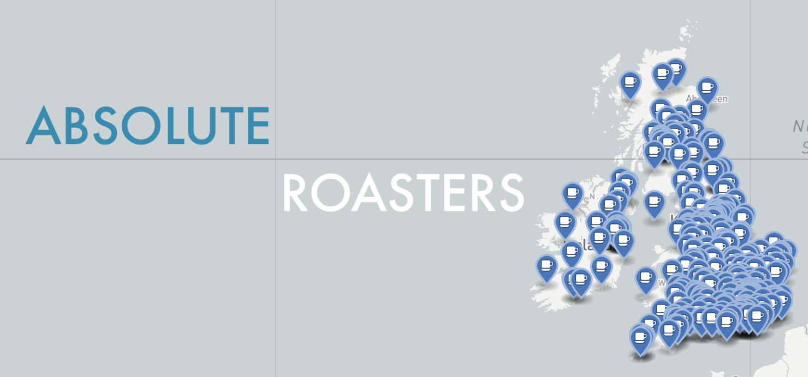

# Absolute Roasters


**A data set of UK Coffee Roasters**

## Usage

For JSON format, query the following URL

```
https://raw.githubusercontent.com/mhamilt/absolute-roasters/main/absolute_roasters.json
```

Data set is an array of coffee roaster objects, which at a minimum should contain

```json
{
  "name": "Roaster Name",
  "url": "https://roaster.url",
  "location": "business address"
}
```

### Optional keys

entries may include extra keys

```json
{
  "coord": [54.665, -2.228],
  "facebook": "facebook_handle",
  "instagram": "instagram_handle",
  "twitter": "@twitterHandle",
  "profile_image_url": "url",
  "description": "business description"
}
```
